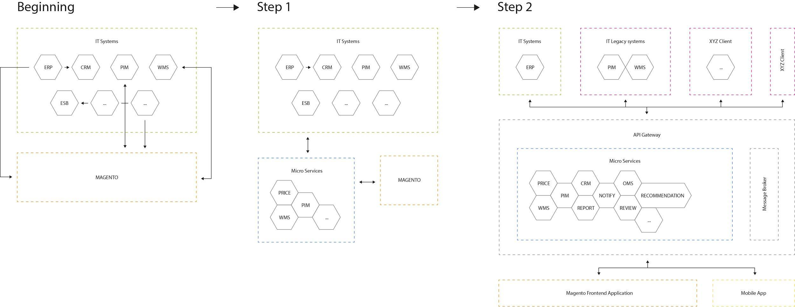

## Case Studies: Re-architecting the Monolith

Here I’ll briefly present two case studies of the microservices evolution which  I’ve been able to observe while working at Divante.

### B2B

One of our B2B clients  came to us with the following issues to be solved:

* While on Magento 1 with SKUs catalog exceeding 1M products - performance bottlenecks relating to catalog and catalog updates became hard to work-around.

* Monolithic architecture, strongly tied to external systems (such as CRM, ERP, WMS) hindered changes and development of new features,.

* CRM that became the SPoF (Single Point of Failure). Pivotal CRM was in charge of too many key  responsibilities including per-customer pricing , cart management and promotions.. Serious amount of technological debt due to legacy code.

* Scalability problems - the platform should be able to handle a new business model that requires broadening the offer and entering new markets.

The online platform was generating 100M+ EUR revenue/year at the time. The challenge was a serious one.

The architecture of this system resembled a "death star". However, its complexity was not between microservices, but between external systems.

The first instinct was to move the site 1:1 from legacy Magento 1 to a new platform.OroCommerce and Magento 2 were considered.

The work on collecting business requirements from stakeholders inside the company and putting them into the Business Requirements Document (BRD) was quickly started. We formulated nearly 1,000 business requirements.Then we mapped them into features. Finally, we scored each available platform on its ability to meet the requirements:

* Functionality available out of the box.

* Functionality after customization.

* Functionality requiring additional/external modules.

* New features.

We double-checked both platforms in terms of technical solutions, scalability, performance, possibility of modification and the possibility of further development.

During the analysis, we realized that it would be somewhat risky to collect all the requirements for such a huge platform right away. We felt that before we had finished analyzing the requirements, they would have changed a few times already. Brief research showed us that none of the systems were capable of meeting all the specific requirements, both functional and non-functional. We realized this was not the right approach and could lead us back to where we started - a monolithic application. 

Before you decide to take a similar step (to go along with a ready-made platform in the center of a microservices eco-system), look at the pros & cons of this approach.

 

Pros & Cons of choosing an end-2-end platform:

**Pros**:

* Rapid development and time to market

* It’s usually a stable, well-tested product.

* A community that will help in solving many problems.

* The possibility to use a large base of ready-made, fully-featured modules (Magento Marketplace).

* Official support from the software provider.

* Official updates, security patches.

**Cons**:

* It’s still a monolithic application that sooner or later will lead us to the starting point - problems with scalability and maintenance.

* Very high licensing costs for the Enterprise version.

* Large platforms require specialists with specific skills for a particular system who can be difficult to acquire.

* Ready-made functionalities often requires serious modifications to fully adapt them, which can lead to incompatibility with the base system - no updates or patches.

* They often provide outdated solutions, limiting the introduction of modern technologies.

#### A New approach

Eventually, after conducting a feasibility study, we suggested that our client use a  more optimal way of solving the problem. The fundamental assumption was to abandon migration to a new platform and change the architecture by deconstructing the current system and deploying it as an eco-system of  distributed microservices. In order to succeed, we needed an effective analysis and implementation process.

*Fig. 7: Agile analysis and implementation process to achieve goals.*

The first step of the "architecture analysis" process was the development of a high-level architecture of the entire system by a team of architects, focused on service responsibilities. The results of their work included:

* Key business processes supported by the system.

* Goals and requirements for scalability, security, performance, SLA and potential development directions.

* Identified risks.

* Block diagram of  disclosed microservices:

    * Defined scope and responsibility of each service.

    * Revelaled patterns of integration between services, taking into account emergency situations handling, avoiding SPoF.

* Defined events and business objects.

* High-level architecture diagram of the system.

The architects worked together along with the client. The client’s domain experts were engaged in session-based workshops using the event storming technique borrowed from the popular Domain Driven Design (DDD) domain modeling approach. You can find more information on the technique on its creator’s blog:[ http://ziobrando.blogspot.com/2013/11/introducing-event-storming.html](http://ziobrando.blogspot.com/2013/11/introducing-event-storming.html)

 

Based on the collected data, the team provided the implementation team with complete documentation.

 

After several workshops, a distributed architecture with dedicated main areas/services was created with the following key services defined:

* PRICING - managing individual prices and promotions for clients.

* PIM (product information management) - responsible for product information and attributes; with planned 1mln+ SKUs it must be implemented as a scalable, probably NoSQL based data warehouse.

* WMS (warehouse management system) - product stock management.

* CRM (customer relationship management) - in charge of syncing  data with Pivotal CRM (orders, statuses, shopping carts …).

* REPORT - reporting and monitoring features.

* NOTIFY - user notifications and alerts management.

* REVIEW - product reviews system.

* RECOMMENDATIONS - recommendations engine.

* FRONTEND APP - in the first version - the good, old  Magento1; then it was planned to move this layer to a ReactJS + NodeJS thin client.

* MOBILE APP.

We started with a 20 page architecture document and then created a list of standards for coding each separate service. We tried to leverage the HTTP protocol standards, providing documentation and technical requirements, such as specific frameworks and database servers to be used. It’s very important to make use of such synthetic and consistent standards while dealing with distributed software.

We decided to start by implementing the first service that is critical for the system due to its SPoF and which would give us the best performance results: PRICING and PIM.

It was crucial to figure out how to  separate the platform from  Pivotal CRM for calculating end-client product prices and therefore to avoid a SPoF and maintain High Availability (initially the platform used real-time WebService calls to get the prices from the CRM when users entered the page) 

PIM was selected to solve problems with growing the SKUs database by moving to an ElasticSearch NoSQL solution instead of Magento’s EAV model.

We created these services as separate Symfony3 applications that were integrated with the Magento1 frontend later on. 

Roughly speaking - we just removed the Magento1 modules responsible for the catalog and wrote our own which called the micro-services instead of hitting the database.

Then we followed this path further, by rewriting and exchanging monolithic modules with distributed services one by one.

The project was finished with a roughly cut-down Magento (serving only as an application frontend) and 9 services supporting all the business logic. One day, if needed, we can simply move on from Magento, implementing a new frontend using a ReactJS/NodeJS stack or any other modern tech stack.

*Fig. 8: Evolutionary (notrevolutionary) steps to create a new platform from a monolithic application.*

Each service was designed with its own denormalized database (ElasticSearch or PerconaDB for relational data orders) and was designed with high availability in mind. Data between services is exchanged via a RabbitMQ data bus using an Event Driven Data Management approach (NOTE:  https://www.nginx.com/blog/event-driven-data-management-microservices/).

We haven’t decided (at this point) to go with any technology other than PHP, so all services were implemented using the Symfony framework; mostly for simplicity, as well as cost optimization of the development process.

You can find more great technologies that focus on microservices later in this book and at[ https://github.com/mfornos/awesome-microservices](https://github.com/mfornos/awesome-microservices)

 

To sum-up our challenge please find our notes on the pros and cons of the microservice approach below: 

**Pros:**

* Small teams can work in parallel to create new, and maintain current, services. Many of you have probably experienced problems with working in large teams, as we did.

* The possibility of using heterogeneous technologies - ElasticSearch for products, PerconaDB for orders..

* Increased critical fault-toleranceby using bulkheads/service contracts..

* Incremental replacement of legacy code and original systems with new,effective solutions..Scalability - we can scale only the services that require it..

* Programmers have a lot of fun, so it’s quite easy to keep the team motivated..

 

**Cons:**

* Extensive client involvement is required during the BA phase.

* New skills and quite a lot of architectural experience is required from developers and architects to design the initial phases.

* New challenges in maintaining the monitoring of the entire infrastructure.

### Mobile Commerce

One of the coolest features of the microservices architecture is that you’re no longer bound to your one-and-only platform. It’s crucial, particularly when the application at hand has to meet different expectations. In our case - an eCommerce platform with dental equipment - we have three different areas to be covered:

* State-of-the-art content management system with e-learning features.

* Basic e-commerce features - checkout and promotions for ordering dental equipment,.CRM features, user profiles and segmentation for tracking all the users.

The platform was designed to work on mobile devices only. At the start we considered whether or not to use one platform for the backend, or maybe to write dedicated solutions. It’s hard to find software with enterprise level CMS, PIM, CRM and e-Commerce features altogether.

Therefore we decided to go with the following software products:

* Pimcore - as a CMS and PIM; we created all the content (e-learning, static pages, product content) in Pimcore and expose it via API.

* Magento2 - as a checkout and for e-commerce features.

* dedicated iOS and Android apps for the frontend.

We used the "Backend for Frontends" approach described in this eBook to provide optimized API gateways for both mobile applications and the RWD website. Key areas like product content and e-learning pages were fully manageable in Pimcore (NOTE:  http://pimcore.org - Enterprise grade Content Management platform, PIM and DAM) and provided the end client with HTML renderings.

Magento checkout was integrated using API REST calls for placing orders.

Nowadays, all new open source products (and of course, not just open-source) expose most of their features via API.  It’s cool to focus on the end client’s value (frontend) and not reinvent the wheel on the backend.

We did almost no custom development work on the backends! 